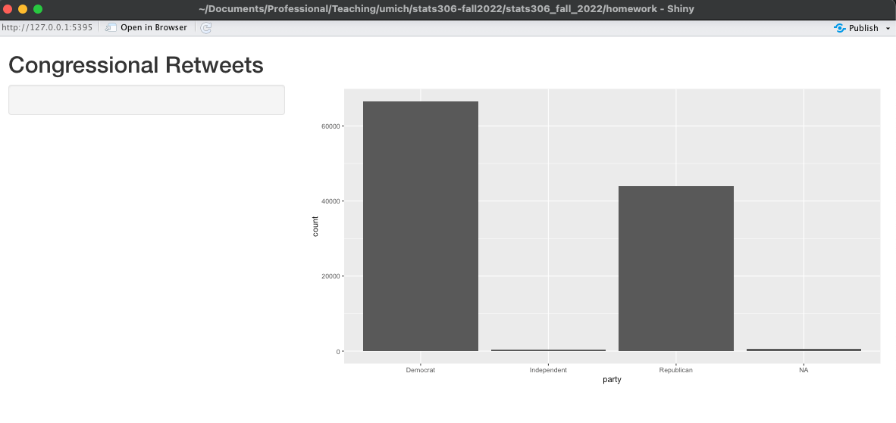

```{r setup, include=FALSE}
knitr::opts_chunk$set(echo = TRUE)
library(tidyverse)
library(lubridate)
library(stringr)
```

## Question 1

The United States Congress, composed of the House of Representatives and the Senate, is seated on a two year basis (while Senators sit for 6 year terms, elections for the Senate are staggered such that composition still changes on a two year cycle). These two year periods are labeled in order, with the 115th Congress occurring in the years 2017-2018.

Researchers at UM's School of Information collected Twitter posts from sitting MoCs (we'll abbreviate "member of Congress" as MoC) during this period and coded them as being original statements or rewteets of other users' submissions. We will focus on the retweet data. These published data include not only the text of the retweet but also information on the member of Congress and the account of the original tweet.

```{r, cache = TRUE}
retweets <- read_csv("../data/retweets_congress_115th.csv.gz", 
                     col_types = cols("tweet_id_str" = "character",
                                      "created_at" = col_datetime("%a %b %d %H:%M:%S %z %Y"))) |>
  drop_na(full_text)
colnames(retweets)
nrow(retweets)
```

## Part (a)

The [American Health Care Act](https://en.wikipedia.org/wiki/American_Health_Care_Act_of_2017) was a bill that, if passed, would have partially repealed the Affordable Care Act. Since potential passage of the AHCA would have implications for the ACA, many Twitter users were using hash tags for both bills.

Write a single regular expression to match whether a tweet (using the `full_text` column) included either `#AHCA` or `#ACA`. Create a new column in the data set that indicates if it includes either of those hash tags. Group the tweets by year and month and graph the number of retweets involving either the AHCA or AHA during the 115th Congress.

For what period were retweets about either the AHCA or AHA most common?

Hint: You can use `floor_date(created_at, "month")` to create a new column that turns the creation date into just the year/month of the observation.

### Part (b)

Using `group_by` and `summarize` create a table that has one row for each member of Congress (ie., grouping on `user_screen_name`). For each member, capture the member's chamber, party, gender, state, and birthday. Find the maximum number of followers and the median number of `rt_followers_count`. Call this table `retweets_moc`. 

Plot the distributions of maximum number of followers broken out by chamber. Use tools for factors to give the chambers better names ("House of Representatives" and "Senate"). 

When plotting, use a log scale for the number of retweet followers (`ggplot(...) + ... + scale_y_continuous(trans='log10')`)


### Part (c)

How often do members of Congress retweet each other?

Use a left join to join the retweets table to the `retweets_moc` on the `rt_user_name` from from the `retweets` table and the `user_screen_name` from the `retweets_moc` table. Save the result as `retweets_within`.

What proportion of retweets are from other members of Congress?

For retweets from within Congress, count how many retweets were within each chamber and across each chamber. Who do members tend to retweet? Their own chamber or the other chamber?

### Part (d)

What hash tags are the most common? A hash tag starts with `#` and then has one or more letters (recall, this can be matched using the following regex class: `[a-zA-Z]`). 

Write a regular expression that will match hash tags and use `str_match_all` to find all hash tags in the `full_text` columns of `retweets`. Then use `map` to remove the "#" from the front of the hash tag using `str_sub`. Finally, use unlist to get a vector of all hash tags used. What was the most common tag?

## Question 2

### Part (a)

A common task in estimation is to find a parameter that maximizes a particular function. In other words, find the parameter that corresponds to where to the function has its largest value.

For example, for independent, identically distributed samples, the **likelihood function** is given by:
$$L(\theta) = \prod_{i=1}^n f(x_i ; \theta)$$
where $f$ is the common density function and $\theta$ is the parameter of interest.

For example, suppose we have a sample of binary observations that are either 1 or 0, and we model them as independent Bernoulli random values with a parameter $\theta$:
$$f(x; \theta) = \theta^x (1 - \theta)^{1 - x}$$

In this case, the likelihood function becomes:
$$L(\theta) = \theta^{\sum_{i=1}^n x_i} (1 - \theta)^{n - \sum_{i=1}^n x_i}$$

Write a function that takes two inputs: the parameter `theta` and a vector `x` and computes the likelihood evaluated at `theta`. Demonstrate your function on the the following:

```{r}
x <- c(1, 0, 1)
theta <- 0.5
```


### Part (b)

For a given sample of values, we then want to maximize the likelihood function by finding the `theta` argument with the highest function value.

```{r}
x_2b <- c(rep(1, 20), rep(0, 30))
```

Now write a function that takes `theta` as an argument and uses the `x` given in the previous chunk to compute the likelihood function. Graph this function on the following inputs:

```{r}
candidate_thetas <- seq(0, 1, length.out = 250)
```

Store your results in a vector called `lvals` (for "likelihood function values"); we'll use this in a later part.

Based on the graph, where would you say the maximum occurs?


### Part (c)

Using iteration, find the value in `candidate_thetas` that has the highest likelihood value. (A better solution would use `which.max`, but we will pretend that function does not exist.)

### Part (d)

A better algorithm for finding the maximum in a set of values is called [Golden Section Search](https://en.wikipedia.org/wiki/Golden-section_search). In GSS, we start by evaluating the function at three points: the two end points ($x_1$ and $x_3$) of our set of values and a point in the middle ($x_2$).

Then, at each step of the algorithm, pick the larger of two intervals $(x_1, x_2)$ and $(x_2, x_3)$. Evaluate $f$ at a new point $x_4$ within that interval. Suppose we picked the left interval $(x_1, x_2)$. If $f(x_4)$ > $f(x_2)$, then the highest point must be in $x_1$ and $x_2$. If $f(x_2) > f(x_4)$, then the highest point must be between $x_4$ and $x_3$. Update the end points and middle points appropriately, and continue the algorighm until the differences between the points are sufficiently small. 

Consider the function $f(x) = 10 - (x - 3)^2$ that has a maximum at $x = 3$.

```{r}
f <- function(x) { 10 - (x - 3)^2 }

curve(f(x), 0, 5)
```

Below is an implementation of one step of golden section search applied to $f$.

```{r}
find_midpoint <- function(a, b) {
  (a + b) / 2
}

gss_one_step <- function(fun, left_point, middle_point, right_point) {
  f_1 <- fun(left_point)
  f_2 <- fun(middle_point)
  f_3 <- fun(right_point)
  
  a <- middle_point - left_point
  b <- right_point - middle_point
  
  looking_left_side <- a > b
  
  new_point <- if (looking_left_side) {
    find_midpoint(left_point, middle_point)
  } else {
    find_midpoint(middle_point, right_point) 
  } 
  
  f_4 <- fun(new_point)
  
  if (looking_left_side) {
    if (f_4 > f_2) {
      return(list(left_point = left_point,
                  middle_point = new_point,
                  right_point = middle_point))
    } else {
      return(list(left_point = new_point,
                  middle_point = middle_point,
                  right_point = right_point))
    } 
  } else {
    ## looking in the right interval
    if (f_4 > f_2) {
      return(list(left_point = middle_point,
                  middle_point = new_point,
                  right_point = right_point))
    } else {
      return(list(left_point = left_point,
                  middle_point = middle_point,
                  right_point = new_point))
    }
  }
}


## first, set the indexes of where we are going to start
start_left  <- 0
start_right <- 5
start_mid   <- find_midpoint(start_left, start_right)

one_step <- gss_one_step(f, start_left, start_mid, start_right)
one_step
map_dbl(one_step, f)
```

Implement a `while` loop that performs `gss_one_step` until either the end points are both within 0.00001 of the middle point or more than 100 steps have been performed. Report the value of the last `middle_point` and the function evaluated at this point. How many steps through the algorithm were required?


### Part (e)

Apply Golden Section Search to your likelihood function from Part (b). Verify your results by checking against your answer for the $\theta$ with the highest likelihood from (b). For which method was the maximum likelihood higher (it probably won't differ much).


## Question 3

### Part (a)

Using R's debugger or the `browser()` function, step through one step of GSS from the example in Part (d) of the previous problem:

```{r}
gss_one_step(f, start_left, start_mid, start_right)
```

Answer the following questions:

- Did the algorithm look in the left or right interval?
- What was the value of $f$ evaluated on the new point? (i.e., `f_4`)

### Part (b)

Using the `bench::mark`, evaluate the speed of your solution in 2(b) and 2(e). Which was faster?

### Part (c)

Use the profiler on the version that took longer. Suggest an area for improvement of this algorithm.

### Part (d)

Rewrite your solution to 2(c) using a parallel computation technique.

## Question 4

Open up the file `homework5_shiny.R`. This file runs a Shiny app. Right now, the app just displays a plot of the number of retweets by party for the 115th Congress.

Update the app to have a `textInput` where users can enter a hash tag. Make the plot display the number of times per year-month where the hash tag was used. Create a screen shot of your Shiny app displaying the trend line for the hash tag "#DACA" and include it in this document using an image tag:




