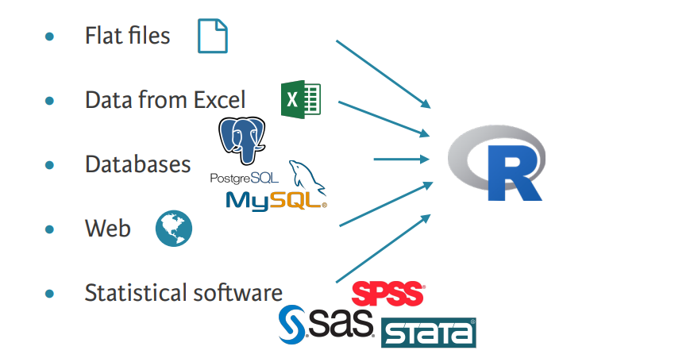

## Set up

```{r installPackages, echo=FALSE, include=FALSE, message=FALSE}
# This just checks if students need to install some packages that they might 
# not have.
if (!require(nycflights13)) install.packages("nycflights13", repos = "http://cran.us.r-project.org")
if (!packageVersion("learnr") == "0.11.1") install.packages("learnr", repos = "http://cran.us.r-project.org")
```

```{r setup, eval=TRUE, include=FALSE, message=FALSE, echo=FALSE}
library(learnr)     # For interactive exercises
library(lubridate)
library(tidyverse)  # For ggplot2, dplyr, readr
library(nycflights13)

tutorial_options(exercise.reveal_solution=FALSE)
```

```{r fake_setup, echo=TRUE, eval=FALSE}
library(learnr)     # For interactive exercises
library(lubridate)
library(tidyverse)  # For ggplot2, dplyr, readr
library(nycflights13)
```

## Logistics

-   Exam 2 is on Nov 11, more details to come.

-   Questions?

## Today's Content


- HW3 Review
- Strings
- EDA and Data Imports
- Tidy Data and Dates
- Table and Relational Data


## HW 3 Review

## Question 1

Let’s look at some water quality data from the Backbay National Wildlife Refuge:

```{r}
bbwater <- read_csv("../data/BKB_WaterQualityData_2020084.csv")
```

## Q 1.1

Provide a short summary of the data. How many columns are there? What kinds of data do we have (what classes of R data)? How many columns are quantitative? How many are nominal? Are there any dates or times?

### Solution

```{r}
dim(bbwater)
```

We see 2371 observations and 17 columns. We can types from the `spec` function (though other methods of finding this information is also acceptable):

```{r}
spec(bbwater)
```

So we see character (string) and double (numeric) columns. We see that 7 columns are character, though it would probably be more accurate to say that only 5 of them are nominal as the `Read_Date` and `DateVerified` columns are ordinal or quantitative. So the remaining 17 - 5 = 12 are quantitative. In addition to the two dates previously listed, we also have a `Time` column.

## Q 1.2

Use `group_by` or `count` to find the number of observations at each `Site_Id`. Update the `bbwater` to remove any sites that have fewer than 5 observations.

### Solution

```{r}
count(bbwater, Site_Id)
```

We observe there are situations with fewer than 5 observations (it might be better to change “d” to “D”), which we remove

```{r}
bbwater <- group_by(bbwater, Site_Id) |> filter(n() > 5) |> ungroup()
count(bbwater, Site_Id)
```

## Q 1.3

Create an ECDF plot for the `Year` variable.

What is this plot telling you about measurements made before the late 1980s? Remember the refuge was started in 1938. Do any of these measurements seem out of place? Remove them from the `bbwater` table. Make a second ECDF after removing these probably erroneous entries.

### Solution

```{r}
ggplot(bbwater, aes(x = Year)) + stat_ecdf()
```

Going back to the description, “The refuge was established in 1938.” We see that there are at least some observations before this date, but not very many. Starting in the late 1980s, we see regular yearly readings with an slightl increase around the year 2000.

We’ll remove the pre-1935 observation (again, probably this typo for 19xx rather than 18xx.)

```{r}
bbwater <- filter(bbwater, Year > 1937)
ggplot(bbwater, aes(x = Year)) + stat_ecdf()
```

## Q 1.4

Here’s a little code that puts all of the numeric data into a table with two columns: `name` (which column) and `value` (the observed value for that variable).

```{r}
bbnumeric <- select(bbwater, where(is.numeric)) |> pivot_longer(everything())
```

Use this data to make a facet plot that shows a histogram plots for all the variables. Use the `scales = "free"` option to `facet_wrap`. Try a few different number of bins to pick a good number

After seeing the small multiples plot, select a variable to generate histogram where you carefully select the number of bins.

### Solution

```{r}
ggplot(bbnumeric, aes(x = value)) + geom_histogram(bins = 50) + facet_wrap(~ name, scales = "free")
```

```{r}
ggplot(bbwater, aes(x = `AirTemp (C)`)) + geom_histogram(bins = 100) # selected after a few tries, only needed to show 1
```

The `bins =` argument should have been set.

## Question 2

## Q 2.1

Create a histogram for `Water Temp (?C)`. Try several numbers of bins to get a useful plot. Would you say that there is one clear typical value for this plot or would you say it contains more than one cluster of values?

### Solution

There appear to be two clusters in the data, one centered around 10 and one centered around 28. However, it could also be argued that there are no clusters. Any such claim needs to be justified based on the plot.

```{r}
ggplot(bbwater, aes(x = `Water Temp (?C)`)) + geom_histogram(bins = 60)
```

The `bins =` argument should have been set.

## Q 2.2

Create a facet plot for `Water Temp (?C)` that breaks out a histogram by `Site_Id`.

Do you think the multiple clusters could be explained by different locations having different temperatures?

### Solution

All the sites, seem to have the same basic pattern, so this does not seem like a candidate for finding a mixture distribution in the water temperature.

```{r}
ggplot(bbwater, aes(x = `Water Temp (?C)`)) + geom_histogram(bins = 60) + facet_wrap(~ Site_Id)
```

## Q 2.3

Look at the `Read_Date` column. Which `lubridate` function could parse this format to a date object? Use it to update the `bbwater` table with `real_date` column. Demonstrate with an ECDF plot of the dates.

```{r}
head(bbwater$Read_Date)
```

### Solution

We the data are in month/day/year formats, so the `mdy` function will be most helpful:

```{r}
bbwater <- mutate(bbwater, real_date = mdy(Read_Date))
ggplot(bbwater, aes(x = real_date)) + stat_ecdf()
```

Since we now have the exact date, we see a much smoother version of the Year ECDF plot.

## Q 2.4

Now use the `month` function to extra the month from each date. Create a facet plot of histograms of the water temp broken out by month. Does this help explain the multiple clusters we saw in the water temp?

### Solution

```{r}
bbwater |> mutate(m = month(real_date)) |>
  ggplot(aes(x = `Water Temp (?C)`)) + geom_histogram(bins = 60) + facet_wrap(~ m)
```

Now we are starting to see some possible clusters that could explain the clusters we saw in the mixture distribution. Unsurprisingly, the summer months have much higher temperatures than the winter months.

## Question 3

## Q 3.1

Create plots of the distributions of `Site_Id` and `Water Depth (m)` (separately). What kinds of data (quantitative, ordinal, nominal) are these two measurements?

### Solution

`Site_id` is nominal, so a bar plot is probably the only option:

```{r}
ggplot(bbwater, aes(x = `Site_Id`)) + geom_bar()
```

The water depth is quantitative, so we could do a box plot, a histogram, or a

```{r}
ggplot(bbwater, aes(x = `Water Depth (m)`)) + geom_density()
```

## Q 3.2

Do you think either of these measurements would benefit from a logarithmic transformation? Implement this transformation and update the plot(s).

Did you get any warnings? What happened?

### Solution

```{r}
bbwater <- mutate(bbwater, logwater = log(`Water Depth (m)`))
ggplot(bbwater, aes(x = logwater)) + geom_density()
```

We did get some warnings, this are the result of having some missing values:

```{r}
count(bbwater, is.na(`Water Depth (m)`))
```

## Q 3.3

Create a plot to show the two variables from 3.1 on one plot. Clearly state if this plot shows the joint distribution or a set of conditional distributions. Describe the plot and if you see any sites with particularly unusual water levels.

### Solution

```{r}
ggplot(bbwater, aes(x = Site_Id, y = logwater)) + geom_violin()
```

This example is a conditional distribution. Other alternatives would be density plots with colors or boxplots.

An example of a joint distribution plot would be a faceted histogram as that would show the frequency of each category as well as the conditional distribution of the within site measurements.

We might notice that B has the highest variance and D is clustered above 0 (so consistently more depth than 1m).

## Question 4

## Q 4.1

Suppose instead of using `tidyverse`’s `read_csv` function we had instead used R’s built in `read.csv` function to load our data.

Use this function to load the same water quality data set. What are three differences in how the type of data loaded by `read.csv` can be used compared to the data from `read_csv`.

### Solution

```{r}
bbw_df <- read.csv("../data/BKB_WaterQualityData_2020084.csv")
class(bbw_df)
```

```{r}
colnames(bbw_df)
```

The result is a `data.frame` instead of tibble. We can see the column names are little less easy to read. The output of head is a little less easy to read.

```{r}
head(bbwater)
```

```{r}
head(bbw_df)
```

## Q 4.2

Convert the result of 4.1 to a tibble. Demonstrate by printing out the result.

### Solution

```{r}
as_tibble(bbw_df)
```

We notice that the names are maintained in the tibble version.

## Q 4.3

Create two tibbles to recreate the first 4 rows of the table of lectures and topics on our Syllabus page. In the first, use tibble. For the second, use tribble.

### Solution

The first 4 rows of the table:

```
Number  Title   Reference   File
00  Introduction to Stats 306   BGG 1, 3; RDS 1.4   lecture00.html
01  Basic R and RMarkdown   RDS 3.4, 6, 20 (selections) lecture01.html
02  Vectors, Tables, and ggplot RDS 29 (selections), 3.0 - 3.3, 3.10    lecture02.html
03  More ggplot RDS 3.6 - 3.8   lecture03.html
```

Tibble solution

```{r}
tibble(Number = paste0("0", 3), # also ok to use numbers 
       Title = c("Introduction to Stats 306",
                 "Basic R and RMarkdown",
                 "Vectors, Tables, and ggplot",
                 "More ggplot"),
       Referece = c("BGG 1, 3; RDS 1.4",
                    "RDS 3.4, 6, 20 (selections)",
                    "RDS 29 (selections), 3.0 - 3.3, 3.10",
                    "RDS 3.6 - 3.8"),
       File = paste0("lecture0", 0:3, ".html"))
```

Tribble solution:

```{r}
tribble(
 ~ Number, ~ Title, ~ Reference, ~ File,
00, "Introduction to Stats 306",    "BGG 1, 3; RDS 1.4",    "lecture00.html",
01, "Basic R and RMarkdown",    "RDS 3.4, 6, 20 (selections)", "lecture01.html",
02, "Vectors, Tables, and ggplot",  "RDS 29 (selections), 3.0 - 3.3, 3.10", "lecture02.html",
03, "More ggplot",  "RDS 3.6 - 3.8",    "lecture03.html")
```

## Q 4.4

Open up the file ‘homework3.txt’. Use a `read_` function to load this data. You will probably need to read the documentation to deal with a few problems in the file.

### Solution

```{r}
read_delim("../../homework/homework3.txt", skip = 3, delim = "|", quote = "\'", na = "NONE")
```

## Strings

Recall that a string is character data enclosed in double `"` or single `'` quotes. In R, strings exist in character vectors.
```{r}
words[1:5]
```

The `stringr` package contains many useful functions for working with strings. In lecture, we went over some commonly used `stringr` functions.

`str_c()` is used to concatenate strings. These strings can be given in separate vectors, in which case the `sep` argument should be used to control what goes between consecutive strings.
```{r}
str_c("lions", "tigers", "bears", "oh my!", sep = ", ")
```

`str_c()` can also be given a single vector of strings. In this case, the `collapse` argument should be used to control what goes between consecutive strings.
```{r}
parts <- c("lions", "tigers", "bears", "oh my!")
str_c(parts, collapse = ", ")
```

`str_length()` essentially returns the number of characters in a string.
```{r}
str_length("My favorite colors are maize and blue.")
```

`str_sub()` extracts a substring of a string. `start` and `end` are the indices of the starting and ending characters of the substring.
```{r}
str_sub("November", start = 3, end = 6)
```

`str_split()` splits a string into substrings given a separator. Note that it returns a list.
```{r}
str_split("lions, tigers, bears, oh my!", pattern = ", ")
```

**Exercise:** Using the vector `base::LETTERS`, make a vector with 25 strings in which the first string is `"A precedes B"`, the second string is `"B precedes C"`, etc.

```{r str_c, exercise=TRUE}

```

```{r str_c-hint}
# Note that LETTERS[-1] contains B through Z
LETTERS[-1]
```

```{r str_c-solution}
str_c(LETTERS[-26], "precedes", LETTERS[-1], sep = " ")
```

## EDA

## Data Imports
- We have previously discussed that data may be available to us for analysis in two major forms: creating them ourselves and importing them from other sources.   
- The major sources of data for importation are summarized in the figure below.

<center>

{width=100%}

</center>

- For the purpose of this class, we narrowed our focus on flat files from the `readr` package.
- Specifically, we have explored using some functions as:
  + `read_csv` - for comma separated values
  + `read_tsv` - for tab separated values
  + `read_delim` - for general delimiters (could be comma, semi-colon, tab, pipe or any delimiter)
  
- Let us answer the following questions based on what we have learned about these functions.

### Question 1 {.tabset}

#### Question 
What function would you use to read a file where fields were separated with
"|"?

#### Answer

Use the `read_delim()` function with the argument `delim="|"`
```
Use the read_delim() function with the argument delim="|"
```


### Question 2 {.tabset}

#### Question 
Apart from `file`, `skip`, and `comment`, what other arguments do `read_csv()` and `read_tsv()` have in common?

#### Answer
They have the following arguments in common:
```{r, eval=FALSE}
intersect(names(formals(read_csv)), names(formals(read_tsv)))
```


### Question 3 {.tabset}

#### Question 
Sometimes strings in a CSV file contain commas. To prevent them from causing problems they need to be surrounded by a quoting character, like `"` or `'`. By default, `read_csv()` assumes that the quoting character will be `"`. What argument to `read_csv()` do you need to specify to read the following text into a data frame using `read_delim()`?

```
"x,y\n1,'a,b'"
```


#### Answer
For `read_delim()`, we will will need to specify a delimiter, in this case `","`, and a `quote` argument.

```{r, eval=FALSE}
x <- "x,y\n1,'a,b'"
read_delim(x, ",", quote = "'")
```


### Question 4 {.tabset}

#### Question 
Identify what is wrong with each of the following inline CSV files. What happens when you run the code?

```
read_csv("a,b\n1,2,3\n4,5,6")
read_csv("a,b,c\n1,2\n1,2,3,4")
read_csv("a,b\n1,2\na,b")
read_csv("a;b\n1;3")
```

#### Answer
1. Only two columns are specified in the header “a” and “b”, but the rows have three columns, so the last column is dropped.
```{r, eval=FALSE}
read_csv("a,b\n1,2,3\n4,5,6")
```

2. The numbers of columns in the data do not match the number of columns in the header (three). In row one, there are only two values, so column `c` is set to missing. In row two, there is an extra value, and that value is dropped.
```{r, eval=FALSE}
read_csv("a,b,c\n1,2\n1,2,3,4")
```

3. Both “a” and “b” are treated as character vectors since they contain non-numeric strings. This may have been intentional, or the author may have intended the values of the columns to be “1,2” and “a,b”.
```{r, eval=FALSE}
read_csv("a,b\n1,2\na,b")
```

4. The values are separated by “;” rather than “,”. Use read_csv2() instead:
```{r, eval=FALSE}
read_csv("a;b\n1;3")

read_csv2("a;b\n1;3")
```


## Tidy Data

Remember that often we have data that is already "tidy". This means that every row corresponds to an observation, every column is a variable, and every cell is a value (see table below).

<center>

{width=100%}

</center>

It's possible, however, that we have untidy data. This happens when 

**Exercise:** Why are we interested in having `tidy` data? (There are several possible solutions to this very open-ended question). 

```{r tidyQ, exercise=TRUE}
# You don't need to put anything here, it's just a placeholder for the solution
```

```{r tidyQ-solution}
# There are many reasons why we might want to have tidy data, but according to Hadley Whickam (R4DS textbook):
# 
# 1. There’s a general advantage to picking one consistent way of storing data. If you have a consistent data structure, it’s easier to learn the tools that work with it because they have an underlying uniformity.

# 2. There’s a specific advantage to placing variables in columns because it allows R’s vectorised nature to shine. As you learned in mutate and summary functions, most built-in R functions work with vectors of values. That makes transforming tidy data feel particularly natural.
```

**Exercise:** Is the dataset below in `tidy` format? If not, how can we fix it? 

```{r huronLevel, exercise=TRUE}
huron_level <- read_csv("data/huron_level.csv", comment = "#")
head(huron_level)
```

```{r huronLevel-hint-1}
# Look at the names of the columns. Are these names really variables of an observation, or are they instead times when observations are obtained? 
```

```{r huronLevel-hint-2}
# The data here seems like they are too "wide": each column really identifies a month and not a new variable! Maybe we should make the data "longer"... 
```

```{r huronLevel-solution}
huron_level %>%
  pivot_longer(
    cols = -year, 
    names_to = "month_abb",
    values_to = "water_level"
  )
```

## Dates 

Dates are a common and tricky data type that we need to deal with often. Here are some things that we need to consider when working with dates: 

- Time intervals between dates are not always constant! For example, if I add 365 days to `2016-01-01`, I get `2016-12-31`!:

```{r}
as.Date("2016-01-01") + lubridate::days(365)
```

- Dates and times can usually be considered as continuous data types, but they are usually stored in files as strings or characters. 

- There is no standard way to store Dates and times. For example: `"2012-03-21"` vs `"03/21/12"`. 

**Exercise:** Convert the following strings into date objects. 

```{r convertDates, exercise=TRUE}
d1 <- "Jan 01, 2019"
d2 <- "11-28-95"
d3 <- "Nov 7, 7:49 PM"
```

```{r convertDates-hint}
# There were several functions that we used to "parse" dates:

# lubridate::ymd
# lubridate::mdy
# lubridate::ydm_hms
# readr::parse_date
# readr::parse_datetime
# and more! 

# Which do you think will be useful? 
```

```{r convertDates-solution}
d1 <- "Jan 01, 2019"
d2 <- "11-28-95"
d3 <- "November 07, '04, 10:04 PM"

# One possbile solution
readr::parse_date(d1, format = "%b %d, %Y")
lubridate::mdy(d2)
readr::parse_datetime(d3, "%B %d, '%y, %H:%M %p")
```


## Table and Relational Data

